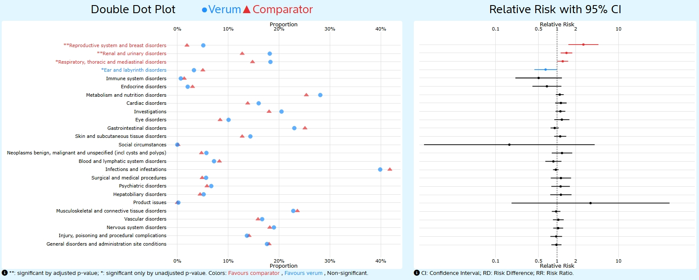
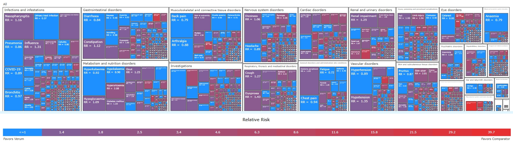
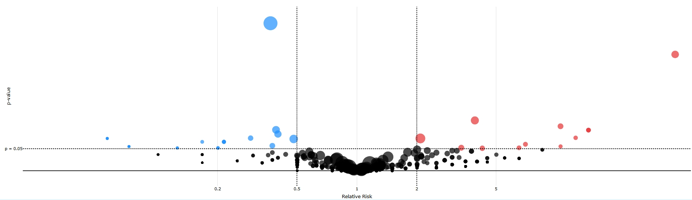

<!-- README.md is generated from README.Rmd. Please edit that file -->

```{r, include = FALSE}
knitr::opts_chunk$set(
  collapse = TRUE,
  comment = "#>",
  fig.path = "man/figures/README-",
  out.width = "100%"
)
```

# `{DetectoR}` - an R Shiny app for Clinical Trial Safety Data

  <!-- badges: start -->
  [](https://github.com/Bayer-Group/BIC-DetectoR/actions/workflows/R-CMD-check.yaml)
  <!-- badges: end -->

The DetectoR R Shiny app provides a handy platform allowing for early identification of signals and an ongoing monitoring of safety along the medical product development phase and lifecycle. DetectoR allows the user to upload the clinical trial data using the typical Analysis Data Model (**ADaM**) in Clinical Data Interchange Standards (**CDISC**). For this, upload the adverse event dataset (**ADAE**) and the subject-level dataset (**ADSL**) in SAS (sas7bdat), CSV, or RDS format via the Data Upload panel.

## Table of Contents

-   [Description](#description)
-   [Getting Started](#getting-started)
-   [Data Requirements](#data-requirements)
-   [Data Selection and Filtering](#data-selection)
-   [Data Visualization](#data-visualization)
-   [Contributing](#contributing)
-   [About](#about)

## Description {#description}

DetectoR is a forward-thinking R Shiny application designed to analyze and visualize safety data in clinical trials. It empowers researchers and statisticians to efficiently identify and monitor adverse events throughout the medical product development lifecycle. By utilizing the Clinical Data Interchange Standards Consortium (CDISC) Analysis Data Model (ADaM), DetectoR streamlines the data upload and analysis process, allowing users to focus on deriving insights rather than preparing data.

With the capability to upload adverse event datasets (ADAE) and subject-level datasets (ADSL) in SAS, CSV, or RDS format, DetectoR offers a user-friendly interface for exploring complex safety data through interactive visualizations. The application features three main analysis displays—the Double Dot Plot, Heatmap, and Volcano Plot—plus a Filter data step and a View dataset tab. Each display is designed to facilitate the identification of safety signals and trends in clinical trial data. By integrating adequate statistical methods and visual analytics, DetectoR enhances the decision-making process for clinical researchers and regulatory professionals.

## Getting Started {#getting-started}

DetectoR is publicly available on GitHub.

### Prerequisites

To get started, ensure you have the following installed: - **R** (\>= 4.1.0): Required for running the application. Install the `remotes` and `usethis` R packages. - **Git**: Necessary for version control and downloading the repository.

### Installation

To install DetectoR, run the following commands in your R console:

``` {r, eval=FALSE}
install.packages(c("remotes", "usethis"))
remotes::install_github("bayer-group/BIC-DetectoR")
```

### Launch the Shiny app

After installation, you can launch the app with the following command:

``` {r, eval=FALSE}
library(DetectoR)
run_app()
```

Follow the user interface to upload your ADAE and ADSL datasets.

## Data requirements {#data-requirements}

**CDISC datasets (ADSL & ADAE)** from studies or pools can be uploaded easily without any further pre-processing into the DetectoR app. For further information on data set requirements, please see the *Data manual tab*.

**Demo data** is available to become easily acquainted with the functionality of the DetectoR app.

**MedDRA datasets** can be uploaded to perform an analysis using Standardized MedDRA queries (SMQs) or other custom groupings. If not, 'Run without MedDRA' can be chosen instead.

### File Format

DetectoR accepts the CDISC datasets ADSL and ADAE in SAS (sas7bdat), RDS, or CSV format.

### File Structure

In order to use DetectoR, the two SAS datasets have to include the following variables (variables marked with (\*) can be manually selected from any available variables in the dataset):

+-----------+-------------------------+----------------------------------------------------------------------------------+---------------------------------------------------------------------------------------------+
| Dataset   | Required Variables      | Label                                                                            | Description                                                                                 |
+===========+=========================+==================================================================================+=============================================================================================+
| ADSL      | STUDYID                 | Study identifier                                                                 | Character variable                                                                          |
+-----------+-------------------------+----------------------------------------------------------------------------------+---------------------------------------------------------------------------------------------+
|           | USUBJID                 | Unique subject identifier                                                        | Character variable                                                                          |
+-----------+-------------------------+----------------------------------------------------------------------------------+---------------------------------------------------------------------------------------------+
|           | SAFFL (\*)              | Safety analysis set flag                                                         | Variable to identify subjects in the Safety analysis set.                                   |
+-----------+-------------------------+----------------------------------------------------------------------------------+---------------------------------------------------------------------------------------------+
|           | DUREXP (\*)             | Duration of exposure                                                             | Integer variable defining the treatment duration.                                           |
|           |                         |                                                                                  |                                                                                             |
|           |                         |                                                                                  | Only needed, if it is intended to present incidence rates.                                  |
+-----------+-------------------------+----------------------------------------------------------------------------------+---------------------------------------------------------------------------------------------+
|           | TRTARM (\*)             | Groups to be compared, usually treatment arms. Any ADSL variable can be selected |                                                                                             |
+-----------+-------------------------+----------------------------------------------------------------------------------+---------------------------------------------------------------------------------------------+
| ADAE      | STUDYID                 | Study identifier                                                                 | Character variable                                                                          |
+-----------+-------------------------+----------------------------------------------------------------------------------+---------------------------------------------------------------------------------------------+
|           | USUBJID                 | Unique subject Identifier                                                        | Character variable                                                                          |
+-----------+-------------------------+----------------------------------------------------------------------------------+---------------------------------------------------------------------------------------------+
|           | AEBODSYS                | Body System or Organ Class                                                       | Character variable                                                                          |
+-----------+-------------------------+----------------------------------------------------------------------------------+---------------------------------------------------------------------------------------------+
|           | AEDECOD                 | Dictionary-Derived Preferred Term                                                | Character variable                                                                          |
+-----------+-------------------------+----------------------------------------------------------------------------------+---------------------------------------------------------------------------------------------+
|           | AEPTCD, M_PT or pt_code | Preferred Term code                                                              | Character variable                                                                          |
+-----------+-------------------------+----------------------------------------------------------------------------------+---------------------------------------------------------------------------------------------+
|           | AAESDURN (\*)           | Time until AE                                                                    | Integer variable defining the number of days from reference day to start date of the event. |
|           |                         |                                                                                  |                                                                                             |
|           |                         |                                                                                  | Only needed, if it is intended to present incidence rates.                                  |
+-----------+-------------------------+----------------------------------------------------------------------------------+---------------------------------------------------------------------------------------------+

> **Note**: ADSL and ADAE will be merged by STUDYID and USUBJID.

### MedDRA data information

> **Note:** To use MedDRA within the app, the MedDRA datasets are required, in SAS (.sas7bdat), R (.rds) or .csv format

+-----------------------------------------------+--------------------+------------------------------------------------+-----------------------------------------------------+
| Dataset                                       | Required Variables | Label                                          | Description                                         |
+===============================================+====================+================================================+=====================================================+
| MedDRA Medical Terms data                     | MT_PT              | Preferred Term                                 | Character variable                                  |
+-----------------------------------------------+--------------------+------------------------------------------------+-----------------------------------------------------+
|                                               | MT_HLT             | High Level Term                                | Character variable                                  |
+-----------------------------------------------+--------------------+------------------------------------------------+-----------------------------------------------------+
|                                               | MT_HLGT            | High Level Group Term                          | Character variable                                  |
+-----------------------------------------------+--------------------+------------------------------------------------+-----------------------------------------------------+
|                                               | MT_SOC             | Body System or Organ Class                     | Character variable                                  |
+-----------------------------------------------+--------------------+------------------------------------------------+-----------------------------------------------------+
|                                               | VERSION            | MedDRA Version number                          | Character or numeric variable                       |
+-----------------------------------------------+--------------------+------------------------------------------------+-----------------------------------------------------+
| MedDRA SMQ (Standardised MedDRA Queries) data | PT_NAME            | Preferred Term                                 | Character variable                                  |
+-----------------------------------------------+--------------------+------------------------------------------------+-----------------------------------------------------+
|                                               | PT_CODE            | Preferred Term Code                            | Character variable                                  |
+-----------------------------------------------+--------------------+------------------------------------------------+-----------------------------------------------------+
|                                               | PT_SMQ_NAME        | SMQ Preferred Term                             | Character variable                                  |
+-----------------------------------------------+--------------------+------------------------------------------------+-----------------------------------------------------+
|                                               | SMQ_NAME           | SMQ name                                       | Character variable                                  |
+-----------------------------------------------+--------------------+------------------------------------------------+-----------------------------------------------------+
|                                               | SMQ_TYPE           | SMQ type                                       | Character variable ("SMQ" or other custom grouping) |
+-----------------------------------------------+--------------------+------------------------------------------------+-----------------------------------------------------+
|                                               | SMQ_STATUS         | SMQ status                                     | Character variable (currently used: "RRL" or "PRL") |
+-----------------------------------------------+--------------------+------------------------------------------------+-----------------------------------------------------+
|                                               | SMQ_ASS_SOC_NAME   | SMQ-associated Body System or Organ Class      | Character variable                                  |
+-----------------------------------------------+--------------------+------------------------------------------------+-----------------------------------------------------+
|                                               | SMQ_ASS_SOC_CODE   | SMQ-associated Body System or Organ Class code | Character variable                                  |
+-----------------------------------------------+--------------------+------------------------------------------------+-----------------------------------------------------+
|                                               | SMQ_MEDDRA_VERSION | MedDRA Version number                          | Character or numeric variable                       |
+-----------------------------------------------+--------------------+------------------------------------------------+-----------------------------------------------------+

> **Important!** All variable names in the table above are case-sensitive, i.e., if ADSL contains the row 'usubjid' (lower case), DetectoR will not work.

## Data selection and filtering {#data-selection}

After datasets are uploaded, the **variable defining the (treatment) groups to be compared** has to be selected out of the variables available in ADSL. Subsequently, the categories defining **the Verum and the Comparator** need to be identified.

Based on subject level characteristics and adverse event categories, generic **data filtering** can be applied any time by using the *Filter tab*. For example, the analyses can be restricted to Serious Adverse Events (SAEs) or adverse events leading to discontinuation, to focus on events of higher severity or impact.

Additionally, **patient-level filters** can be added, e.g., for baseline characteristics like the usual covariates (sex, age or BMI), but also for any co-morbidity or risk factor included in the input data set.

## Data visualization {#data-visualization}

After the data is uploaded, treatment is defined and filters are applied, the tabs *Double Dot Plot*, *Heatmap*, *Volcano Plot*, and *View Dataset* are available to explore the data.

### The Double Dot Plot



The heart of DetectoR is the Double Dot Plot, which allows for a **clear overview** of dense information **gaining data insights quickly**.

The Double Dot Plot shows, for each adverse event of interest, the **incidence proportion** or **incidence rate** per treatment group, combined with an **effect estimate**. For comparison of the treatments, **risk differences (RD)** and **relative risks (RR)** can be chosen.

#### p-Value Calculation

For a more straightforward detection of relevant signals, different techniques for calculation of **multiplicity adjusted p-values** are implemented and can be chosen from the parameter settings, i.e. the **False Discovery rate (FDR)** and the **new Double FDR (DFDR)**[^1].

[^1]: [Flagging clinical adverse experiences: reducing false discoveries without materially compromising power for detecting true signals (Devan V. Mehrotra and Adeniyi J. Adewale, Statistics in Medicine 2012, 31 1918-1930)](https://pubmed.ncbi.nlm.nih.gov/22415725/)

> **Note**: The new Double FDR (DFDR) method is only available for Preferred Terms (PTs) and custom groupings that are mutually exclusive.

With the option to **order the adverse events based on either the adjusted p-values or the risk estimates**, the relevant safety signals can be detected easily.

#### Adverse Events Grouping

A first glance on the overall safety profile can be drawn from comparing the **Body System Organ Classes (SOCs)**. Additional categorizations/types can be investigated, like **Preferred Terms (PTs)** or **Standardized MedDRA Queries (SMQs)**, including all parent and sub-SMQs is possible.

> **Note**: Standardized MedDRA Queries (SMQs) are available only if MedDRA files are uploaded.

#### Advanced settings

The following advance settings can be adapted:

-   Calculation of **stratified estimates** is available, e.g., stratification by study, in case data from an integrated database is used. While the stratified incidence proportions are study-size adjusted, the risk differences and relative risk are derived using Mantel-Haenszel stratification.

-   The analyses can be restricted to **Tier 2 events** in two ways:

    -   Events can be restricted to minimum number of events in verum required to achieve a significant result.

    -   Events can be restricted to only such with an incidence of at least 1%.

-   p-values can be calculated either one or two-sided.

-   The **significance level (alpha)** can be chosen as 1, 5 or 10%.

### The Data View

All data provided in the Double Dot Plot can also be found in the *View Dataset* tab and easily be filtered and sorted as required.

### The Heatmap



A heatmap/treemap based on the MedDRA hierarchy presents the second highlight of DetectoR. It provides an appealing and interactive overview of the **distribution of adverse events across different groupings**. With this graphical display either PTs within SOCs or custom groupings within SOCs can be discovered by zooming in and out of the SOC.

The size of the presented boxes is based on the number of events in the corresponding AE category. A color coding either based on p-values or effect estimates allows the users to adjust the heat map according to their particular needs.

Similar to the generic filtering for the double dot plot described above, multiplicity adjustments, consideration of risk estimates and risk differences as well as study stratification are possible for the heatmap.

The Volcano Plot



Another feature of the DetectoR app is the Volcano Plot. This plot offers an interactive display of the Adverse Event signals by **plotting the risk estimate of each adverse event against the p-value**. Additionally, the red/blue colour coding and plot positioning offers an insight in whether each event is significant for the Verum or Comparator. Like the Double Dot Plot, the event types shown can be changed. Other options include choosing to display the RR or the RD and choosing the displayed Alpha level as 1%, 5% or 10%. Using the plotly package, this graphic is vastly **interactive**, offering the option to select points, alter the display and download the plot.

## Contributing {#contributing}

Contributions are welcome! If you have suggestions for improvements or find bugs, please open an issue or submit a pull request. To contribute, please follow these steps:

1.  Fork the repository.

2.  Create a new branch for your feature or bug fix.

3.  Make your changes and commit them.

4.  Push your changes to your forked repository.

5.  Submit a pull request.

::: {align="center"}

:::

## About {#about}

You are reading the doc about version : `r golem::pkg_version()`

